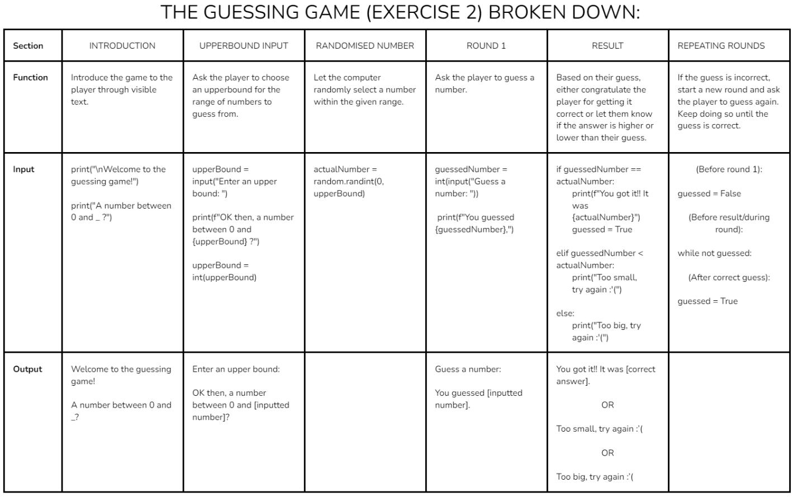

TODO: Reflect on what you learned this week and what is still unclear.

Unpacking Exercise 2:

Thoughts on 'A Code Reading Experience!':
The easiest code to read from these examples were the ones that began in a similar way to my solution.
These began with:
def loops_7():
columns = []
for i in range(5):
rows = []

The one most similar to my solution was sheldakristie's.
We both looked for the number patterns for each symbol in the list in relation to i.
For the stars, this was: 1, 3, 5, 7, 9
Instead of:
for j in range(1+i):
ihatepyramids_inside.append("_")
for j in range(0+i):
ihatepyramids_inside.append("_")

I used:
for j in range(2*i + 1):
pyramid_row.append("*")

The other examples that used unfamiliar techniques were harder to read.
